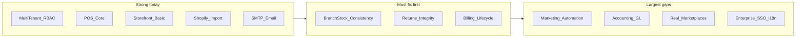
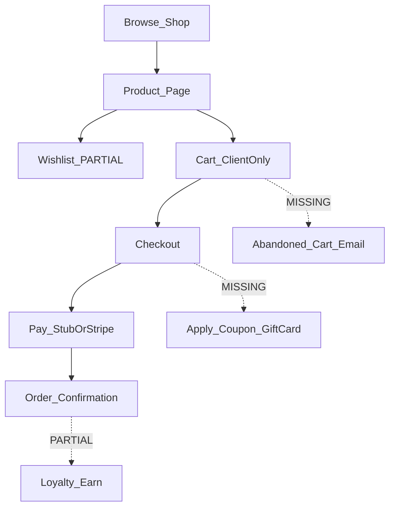
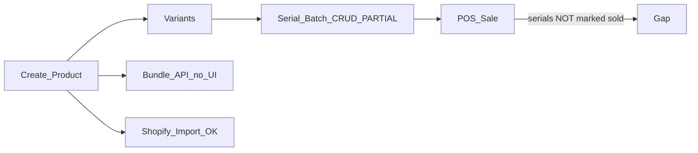
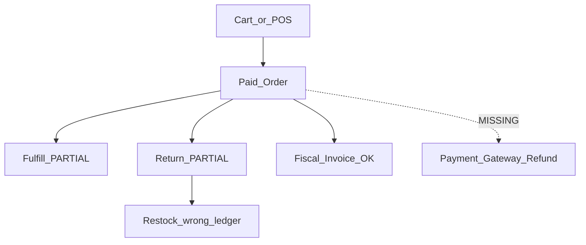
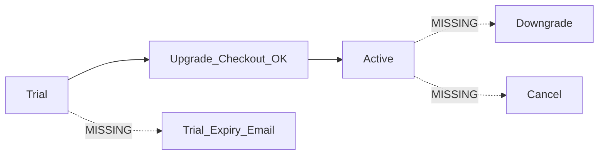

# PosHive / PosHive – Missing Features & Product Gap Analysis

**Audit basis:** Live codebase (migrations 001–014, modules, frontend pages), not marketing claims. Many listed capabilities are **PARTIAL** (schema/API without full sale/restock/UI wiring) or **stubs**.

**Competitive position (honest):** Strong multi-tenant SaaS skeleton (tenancy, RBAC, billing shell, POS+storefront+Shopify import+SMTP). Weaker than Square/Shopify/Lightspeed on payments depth, hardware, returns integrity, marketing automation, and real channel sync. Weaker than Odoo/Zoho on accounting/manufacturing. Closer to Loyverse/Vend for SMB retail, but incomplete on inventory correctness and subscription self-serve.

---

## Current-state truth (critical)

| Claimed area | Reality |
|--------------|---------|
| Multi-branch inventory | **PARTIAL** — `branch_stock` used on sale/transfer/PO; stock take / manual adjust / returns often ignore it |
| Serials / batches / bundles | **PARTIAL** — CRUD exists; POS sale does not consume serials/batches; no bundle UI |
| Returns / refunds | **PARTIAL** — API+UI; no gateway refund; branch_stock desync |
| Marketplace (Amazon etc.) | **STUB** — credentials + webhook dispatch only |
| Affiliates | **PARTIAL** — admin shell; no attribution / commission creation |
| AI | **PARTIAL** — reorder heuristics + optional OpenAI Q&A only |
| Accounting / manufacturing / SSO / i18n / franchise | **MISSING** |
| Subscription cancel/downgrade / trial emails | **MISSING** (templates seeded, not delivered) |

Cross-cutting debt to fix before new modules: **unify stock on `branch_stock`**, wire serial/batch on sale/return, complete subscription lifecycle emails.

---

## 1. Missing / incomplete modules

For each: Priority · Revenue · Complexity · Tables · APIs · Pages · Permissions · Feature pack.

### Critical (ship or fix before Codecanyon “complete POS” claim)

| Module | Priority | Revenue | Complexity | DB | API | Frontend | Permissions | Pack |
|--------|----------|---------|------------|----|-----|----------|-------------|------|
| **Inventory integrity (branch_stock unify)** | Critical | High (trust) | Medium | extend use of `branch_stock`, `inventory_transactions` | PATCH inventory adjust/stock-take/return to call `branch-stock.service` | StockTake, Inventory, OrderDetail | `inventory.manage` | `inventory_pro` |
| **Returns & refunds hardening** | Critical | High | Medium | `order_returns`, payment refund refs | `POST /orders/:id/return`, `POST /orders/:id/refund` (gateway) | OrderDetail return wizard | `orders.refund` | `pos_pro` |
| **Serial/batch on sale & receive** | Critical | High (verticals) | High | `product_serials`, `product_batches` | POS line serials; PO receive lot/expiry | POS serial dialog; PO receive; expiry alerts | `products.manage`, `inventory.manage` | `catalog_pro` |
| **Subscription lifecycle** | Critical | High (SaaS MRR) | Medium | `subscriptions` | cancel, downgrade, resume | Subscription.jsx | `billing.manage` | platform |
| **Trial/billing email jobs** | Critical | Medium | Low | use `email_templates` | worker cron | — | platform admin | — |
| **Cashier shifts** | Critical | Medium | Medium | `shifts` (exists) | `POST /shifts/clock-in|out`, Z-report | Shifts + POS gate | `drawer.manage` | `staff_pro` |
| **PIN login session** | Critical | Medium | Medium | — | issue JWT from `pin-login` | POS lock screen | — | `staff_pro` |

### High (growth / sellable add-ons)

| Module | Priority | Revenue | Complexity | DB | API | Frontend | Permissions | Pack |
|--------|----------|---------|------------|----|-----|----------|-------------|------|
| **Abandoned cart recovery** | High | High | Medium | `storefront_carts`, `cart_recovery_jobs` | cart persist, recover send | Admin automation + storefront restore | `marketing.send` | `omnichannel` / new `marketing_pro` |
| **Email & SMS campaigns** | High | High | High | `campaigns`, `campaign_sends`, segments | CRUD + send queue | Marketing pages | `marketing.manage` | `marketing_pro` |
| **Customer segments (activate)** | High | Medium | Medium | `customer_segments` (exists) | CRUD + resolve members | Segments UI | `customers.manage` | `crm_pro` |
| **Loyalty tiers / referral** | High | High | Medium | `loyalty_tiers`, `referrals` | tier rules, referral redeem | Settings + Account | `crm.manage` | `crm_pro` |
| **Affiliate attribution** | High | Medium | Medium | use `affiliates`, `affiliate_commissions` | track click, attribute order | Storefront + admin | platform | — |
| **Receipt / label printing** | High | High | Medium | printer settings | print jobs / ESC-POS | POS print | `pos.use` | `pos_pro` |
| **Hardware / payment terminal** | High | Very High | Very High | `terminals` | Stripe Terminal / reader | POS terminal pair | `payments.manage` | `pos_pro` |
| **Tax liability reports** | High | High | Medium | views on orders tax | `GET /reports/tax` | Reports tax tab | `reports.view` | `tax_advanced` |
| **Z/X cashier reports** | High | Medium | Medium | drawer + orders | `GET /reports/z` | Drawer close report | `drawer.manage` | `staff_pro` |
| **Bundle product UI** | High | Medium | Low | `product_bundle_items` | existing APIs | ProductDetail bundles | `products.manage` | `catalog_pro` |
| **Storefront coupons & gift cards** | High | High | Medium | existing tables | checkout apply | Checkout.jsx | — | `catalog_pro` / gift |
| **Wishlist complete** | High | Low | Low | `storefront_wishlists` | toggle (exists) | Product heart button | — | `omnichannel` |
| **Webhook retries + event catalog** | High | Medium | Medium | `webhook_deliveries` | retry worker | Webhooks delivery log | `settings.manage` | `omnichannel` |
| **Public API expand** | High | Medium | Medium | — | products/customers write, inventory, refunds | Developers docs | api key scopes | — |
| **Real marketplace adapters** | High | Very High | Very High | `marketplace_integrations` | Amazon/eBay/TikTok sync | Marketplace.jsx | `integrations.manage` | `omnichannel` |
| **Domain DNS verify (real)** | High | Medium | Medium | `tenant_domains` | TXT check | DomainsSection | `settings.manage` | `omnichannel` |

### Medium (enterprise / vertical)

| Module | Priority | Revenue | Complexity | DB | API | Frontend | Permissions | Pack |
|--------|----------|---------|------------|----|-----|----------|-------------|------|
| **Accounting / GL** | Medium | High (upsell) | Very High | `accounts`, `journal_entries`, `journal_lines` | journals, P&L, BS, CF | Finance module | `accounting.view` | `finance_pro` |
| **Payroll** | Medium | Medium | High | `payroll_runs`, `payslips` | run/approve | Payroll pages | `payroll.manage` | `hr_pro` |
| **Manufacturing / BOM / production** | Medium | High (vertical) | Very High | `boms`, `production_orders` | explode/consume | Manufacturing | `mfg.manage` | `mfg_pro` |
| **Vendor portal** | Medium | Medium | High | vendor users | PO view/ASN | Vendor SPA | vendor role | `inventory_pro` |
| **Multi-currency / FX** | Medium | High | High | `exchange_rates`, price lists | convert | Settings + POS | `settings.manage` | `finance_pro` |
| **i18n / multi-language** | Medium | High | High | locale packs | — | i18n framework | — | platform |
| **SSO (OIDC/SAML) + SCIM** | Medium | Enterprise | High | `sso_configs`, SCIM users | `/auth/sso`, `/scim/v2` | Admin SSO | platform | `enterprise` |
| **Franchise / org hierarchy** | Medium | Enterprise | Very High | `orgs`, `org_tenants` | rollup reports | Franchise HQ | platform | `franchise` |
| **B2B corporate accounts** | Medium | High | High | `company_accounts`, net terms | quotes/approvals | B2B portal | `b2b.manage` | `b2b_pro` |
| **White-label admin** | Medium | High | High | brand assets per reseller | theming | Reseller console | platform | `whitelabel` |
| **Advanced custom permissions** | Medium | Medium | Medium | custom roles UI | CRUD permissions | Roles matrix | `team.manage` | `staff_pro` |
| **Push notifications (FCM/web)** | Medium | Medium | Medium | `push_subscriptions` | send | Marketing | `marketing.send` | `marketing_pro` |
| **AI content + forecasting** | Medium | High | High | `ai_jobs` | generate/forecast | Products, AI Insights | `ai.use` | `ai_pro` |
| **Kitchen / restaurant (Toast-like)** | Medium | High (vertical) | Very High | `kds_tickets`, modifiers | KDS feed | KDS screen | `pos.use` | `restaurant_pro` |
| **Appointments / services** | Medium | Medium | High | `appointments` | book | Calendar | — | `services_pro` |

---

## 2. Missing / incomplete business flows

### Customer journey (storefront)

**Gaps:** no abandoned cart; wishlist add on product page incomplete; no storefront coupon/gift card; related products = random category only; no post-purchase review prompt automation.

### Product lifecycle

### Order lifecycle

### Return & refund — incomplete vs Square/Shopify

- Partial return UI exists; no over-return guard; restock skips `branch_stock`; serials not returned; no Stripe refund; no restocking fee / exchange flow.

### Supplier / purchase / inventory

- Supplier CRUD + PO receive = mostly OK; **PO `branch_id` not in migration** (always default branch); no ASN/vendor portal; stock take ignores branch ledger; transfers lack cancel/`in_transit`.

### Subscription flow

### Staff workflow

- Drawer open/close exists; shifts table unused; PIN login does not issue session; team invite returns temp password (no email invite token); roles limited to manager/cashier.

---

## 3. Enterprise features vs leaders

| Feature | PosHive | Leaders | Gap |
|---------|---------|---------|-----|
| Multi-warehouse | Branches only | Lightspeed/Odoo warehouses | No warehouse entity; branch stock inconsistent |
| Franchise / parent-child | Missing | Toast multi-location HQ | Org hierarchy, royalties |
| Corporate / B2B accounts | Missing | Shopify Plus, Odoo | Net terms, quotes |
| White-label SaaS | Theme + domains partial | Many Codecanyon “reseller” scripts | Full admin rebrand / reseller billing |
| Multi-currency | Single currency/tenant | Shopify, Odoo | FX rates, multi-price |
| Multi-language | Missing | All majors | i18n |
| Regional tax | Tax rules OK; filing reports missing | Avalara-class | Nexus, tax returns |
| Audit compliance | Audit logs + GDPR tools | Enterprise SOC tooling | Immutable export, SSO audit |
| Data export | CSV/JSON partial | Full data portability | Scheduled exports, all entities |
| SSO / SCIM | Missing | Enterprise Square/Shopify | OIDC + SCIM |
| Advanced permissions | Fixed seed roles | Granular | Custom role matrix |

---

## 4. Missing AI features (implementation ideas)

| Feature | Status | Implementation idea |
|---------|--------|---------------------|
| AI reorder | Exists (heuristic) | Keep; add seasonality + lead time from PO history |
| Sales forecasting | Missing | Daily sales time series → Prophet/OpenAI tool; chart on Reports |
| Inventory prediction | Partial via reorder | Stockout date = qty / velocity per branch |
| Business assistant | Partial (`POST /ai/insights`) | RAG over tenant orders/products; cite numbers only |
| Product description generator | Missing | `POST /ai/generate-description` from title/attrs; write to product |
| AI email writer | Missing | Template draft in Email Templates admin |
| AI chat support | Missing | Embed on storefront + ticket draft to `/tickets` |
| AI analytics | Missing | NL → SQL-safe report builders with allowlisted queries |
| Recommendations | Random related | Collaborative filter from `order_items` co-occurrence |

New pack: **`ai_pro`**. Tables: `ai_generations`, usage metering against plan.

---

## 5. Missing commerce features

| Feature | Status | Note |
|---------|--------|------|
| Wishlist | PARTIAL | Add toggle on Product page |
| Abandoned cart | MISSING | Persist cart + BullMQ drip |
| Email automation | MISSING | Campaigns on top of SMTP module |
| SMS marketing | MISSING | Reuse `sms.service.js` + segments |
| Push notifications | MISSING | Web Push + FCM |
| Product recommendations | PARTIAL | Co-purchase model |
| Upsell / cross-sell | MISSING | Checkout + POS prompts |
| Affiliate program | PARTIAL | Wire attribution on order |
| Loyalty levels | PARTIAL | Points exist; add tiers |
| Referral system | MISSING | Customer referral codes |

---

## 6. Missing inventory features

| Feature | Status |
|---------|--------|
| Batch / lot / expiry | PARTIAL CRUD; not on sale/receive |
| Serial numbers | PARTIAL CRUD; not on sale/return |
| Manufacturing / BOM / assembly / production | MISSING |
| Vendor portal | MISSING |
| FEFO / expiry alerts | MISSING |
| Barcode: variant exact match + label print | PARTIAL |

---

## 7. Missing finance features

| Feature | Status |
|---------|--------|
| Expenses | FULL |
| Simple P&L (rev − expenses) | PARTIAL |
| GL / journal / balance sheet / cash flow | MISSING |
| Tax reports | MISSING |
| Expense categories (structured) | PARTIAL (free text) |
| Payroll | MISSING |
| Payment-method mix / tip reports | MISSING |

---

## 8. Marketplace integrations

| Integration | Status | Path |
|-------------|--------|------|
| Shopify | FULL import | Keep; add order/inventory bidirectional later |
| Amazon / eBay / Etsy / TikTok / Meta / Google | STUB UI | Replace stub in [`marketplace.service.js`](backend/src/modules/marketplace/marketplace.service.js) with real adapters |
| WooCommerce | MISSING | REST product sync |
| Zapier | MISSING | Public API + OAuth app |
| WhatsApp | PARTIAL notify | Business API catalogs / order alerts |
| Slack | MISSING | Order/low-stock webhooks to Slack |

---

## 9. Codecanyon value score

| Dimension | Score (1–10) | Rationale |
|-----------|--------------|-----------|
| Market value (as-is) | **6.5** | Rare full multi-tenant POS+storefront+billing in one repo |
| Competitor parity (SMB) | **5** | Behind Square/Shopify on payments/hardware/returns polish |
| Competitor parity (ERP) | **3** | No GL/mfg vs Odoo/Zoho |
| Code quality / SaaS bones | **7.5** | Tenancy, packs, queues, SMTP admin, Shopify worker |
| Demo readiness | **5** | Broken/incomplete flows hurt demos (returns, stock take multi-branch, marketplace) |
| Codecanyon sales potential (current) | **6/10** | Sellable as “SaaS POS starter”; not as Lightspeed replacement |
| After Phase 1+2 | **8/10** | Credible premium script with marketing + inventory trust |

**Missing selling points buyers expect:** hardware/terminal story, rock-solid returns, marketing automation, real Amazon sync, accounting export (QuickBooks/Xero), white-label reseller.

**Premium add-ons (upsell packs):** `marketing_pro`, `finance_pro`, `ai_pro`, `mfg_pro`, `restaurant_pro`, `enterprise` (SSO), marketplace channel packs.

---

## Roadmap

### Phase 1 — Must Have (trust + SaaS money) · ~10–14 weeks · 2–3 devs

1. Unify inventory on `branch_stock` (stock take, adjust, returns).
2. Harden returns (over-return guard, serials, optional Stripe refund).
3. Wire serial/batch on POS + PO receive; bundle UI.
4. Shifts + PIN session login; fix drawer expected cash.
5. Subscription cancel/downgrade + trial/activated/expired email cron.
6. Storefront: wishlist button, coupons/gift cards at checkout.
7. Tax + Z reports; real DNS domain verify.
8. Feature-pack enforcement gaps (`staff_pro` on team, `crm_pro` on earn/tags).

**Codecanyon impact:** +1.5–2 points (stops “demo fails” reviews).

### Phase 2 — Growth · ~12–16 weeks

1. Abandoned cart + email/SMS campaigns + segments.
2. Loyalty tiers + customer referral; affiliate attribution.
3. Upsell/cross-sell + better recommendations.
4. Webhook retries; expand public API; Zapier-ready docs.
5. Receipt/ESC-POS printing; barcode label print; variant barcode exact search.
6. One real marketplace (Amazon **or** WooCommerce) end-to-end.
7. Offline PWA: catalog cache + Background Sync.

**Codecanyon impact:** +1–1.5 (marketing + channels = premium price tier).

### Phase 3 — Enterprise · ~16–24 weeks

1. Multi-currency; i18n.
2. SSO (OIDC) + SCIM; custom permission matrix.
3. Accounting GL + Xero/QB export; tax filing reports.
4. White-label / reseller; franchise org (optional).
5. B2B accounts; vendor portal.
6. Manufacturing BOM (if targeting inventory-heavy niches).

### Phase 4 — AI · ~8–12 weeks (can overlap Phase 2)

1. Forecast + stockout dates.
2. Description/email generators.
3. Storefront AI support → tickets.
4. Co-purchase recommendations.
5. Metered `ai_pro` usage.

---

## Final summary tables

### Development priority (top 15)

1. Branch stock integrity  
2. Returns/refunds integrity  
3. Serial/batch sale wiring  
4. Billing cancel + trial emails  
5. Shifts + PIN login  
6. Abandoned cart  
7. Campaigns (email/SMS)  
8. Storefront tender (coupon/GC)  
9. Tax + Z reports  
10. Bundle UI  
11. Loyalty tiers + referral  
12. Affiliate attribution  
13. Print / barcode polish  
14. One real marketplace adapter  
15. AI descriptions + forecasting  

### Revenue impact (qualitative)

- **Critical inventory/returns:** protects churn; required for paid renewals.  
- **Marketing automation + abandoned cart:** highest incremental SaaS ARPU.  
- **Hardware/terminal + real marketplaces:** highest new logo conversion.  
- **Finance/SSO/franchise:** enterprise deals; longer sales cycle.  
- **AI pack:** easy Codecanyon “Pro” upsell (+20–40% license price).

### Estimated development time (calendar, 2 full-stack)

| Phase | Time | Effort |
|-------|------|--------|
| Phase 1 | 10–14 weeks | ~5–7 person-months |
| Phase 2 | 12–16 weeks | ~6–8 person-months |
| Phase 3 | 16–24 weeks | ~10–14 person-months |
| Phase 4 | 8–12 weeks | ~4–6 person-months |
| **Total to “enterprise+AI”** | **~12–18 months** | **~25–35 person-months** |

### Codecanyon sales impact

| Stage | Suggested price band | Expected impact |
|-------|---------------------|-----------------|
| As-is | $59–99 | Moderate sales; refund risk from incomplete flows |
| Post Phase 1 | $99–149 | Stronger ratings; “production SaaS POS” claim credible |
| Post Phase 2 | $149–249 + add-ons | Top-quartile multi-tenant POS scripts |
| Post Phase 3–4 | $249–399 + annual support | Compete with premium SaaS scripts; add-on marketplace packs |

---

## Recommended next step after approval

Do **not** start Phase 3/4 first. Implement Phase 1 as a tracked engineering epic (inventory integrity → returns → billing lifecycle → staff shifts), then productize Phase 2 marketing packs for Codecanyon differentiation.

This document is the audit deliverable; implementation should be split into separate plans per phase when you are ready to build.
