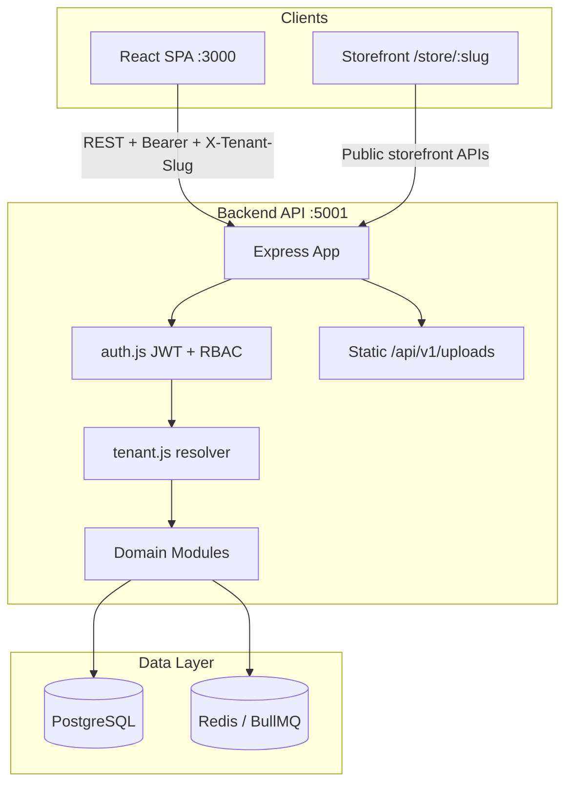
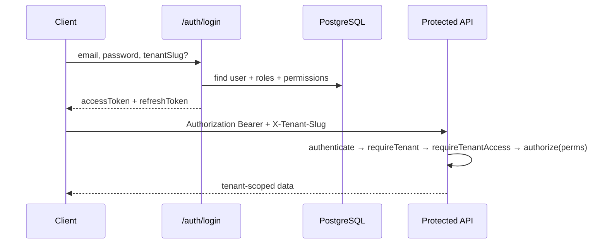

# EYZ POS — Complete Platform Audit (Master Report)

**Audit date:** 2026-06-15  
**Scope:** Full stack — backend, frontend, database, DevOps, SaaS readiness  
**Methodology:** Static code review, schema analysis, threat modeling, workflow tracing (no production penetration test)

---

## 1. Executive Summary

EYZ POS is a **multi-tenant SaaS POS + storefront** built on Node/Express/PostgreSQL (backend) and React/Vite/MUI (frontend). The platform has **broad feature coverage** for an MVP (POS, inventory, products, orders, subscriptions, admin, storefront, CMS, affiliates, tickets) but is **not production-ready** for a high-trust SaaS investment without significant security, validation, and test hardening.

### Top 5 blockers before production

| # | Issue | Severity |
|---|-------|----------|
| 1 | **Client-controlled order pricing** — POS and storefront accept `unit_price` from client | Critical |
| 2 | **SQL injection via ORDER BY** in `BaseRepository.findAll` | Critical |
| 3 | **Ticket IDOR** — any authenticated user can mutate any ticket | Critical |
| 4 | **No input validation** outside auth module (Joi only on `/auth`) | High |
| 5 | **Zero automated test coverage** — Jest configured but no tests | High |

### Production Readiness Score: **42 / 100**

| Category | Score |
|----------|-------|
| Architecture | 62 |
| Security | 28 |
| Scalability | 45 |
| Performance | 48 |
| Maintainability | 55 |
| Test Coverage | 5 |
| SaaS Readiness | 40 |
| Multi-Tenant Readiness | 35 |

---

## 2. System Architecture



### Folder structure

```
POS/
├── backend/src/
│   ├── app.js, server.js, config/
│   ├── middleware/ (auth, tenant, upload, audit, validate)
│   ├── shared/ (base.repository, plan-limits, crud.factory)
│   ├── services/ (upload, email)
│   ├── modules/ (auth, products, orders, inventory, storefront, platform, ...)
│   └── database/migrations/ (001-004)
├── frontend/src/
│   ├── App.jsx (routes)
│   ├── layouts/ (Admin, Business, Storefront)
│   ├── pages/ (auth, admin, business, storefront)
│   ├── components/ (shared UI kit)
│   └── features/ (auth, pos cart, storefront cart)
└── docs/audit/
```

---

## 3. Authentication & Authorization Flow



**Gaps:** MFA setup exists but **not enforced at login** (`auth.service.js`). `fetchMe` not called on frontend app load — admin session breaks on refresh. Impersonation issues full owner token to `support_agent`.

---

## 4. Tenant Isolation Strategy

- **Resolution:** `X-Tenant-Slug`, `X-Tenant-Domain`, or Host subdomain (`tenant.js`)
- **Enforcement:** Application-layer `tenant_id` in `BaseRepository`
- **Database:** **No Row Level Security (RLS)**
- **Bypass paths:** Platform admins, public storefront, static uploads, tickets router (weak), notifications (no `requireTenantAccess`)

**Can Tenant A access Tenant B data?**  
**Yes, in multiple scenarios** if application checks are bypassed or bugs exploited (IDOR on tickets, client price manipulation, missing tenant_id on some UPDATEs, header spoofing for support agents on notifications).

---

## 5. Critical Issues (Must fix before launch)

### C1 — Client-controlled pricing
- **Files:** `backend/src/modules/orders/orders.service.js:101-112`, `storefront.checkout.service.js`
- **Root cause:** `unit_price`, `discount`, `tax` taken from request body without DB lookup
- **Fix:** Server-side price resolution from `products`/`product_variants`; reject client prices for storefront

### C2 — SQL injection (ORDER BY)
- **File:** `backend/src/shared/base.repository.js:58-59`
- **Root cause:** `orderBy` and `order` interpolated into SQL
- **Fix:** Whitelist columns and `ASC`/`DESC` only

### C3 — Ticket IDOR
- **Files:** `tickets.service.js:74-95`, `tickets.routes.js:6-14`
- **Root cause:** No tenant/ownership checks on reply/close
- **Fix:** `requireTenantAccess`, verify `ticket.tenant_id`, `authorize('business.support')`

### C4 — Mass assignment on CRUD entities
- **File:** `backend/src/shared/base.repository.js:70-106`
- **Root cause:** `create`/`update` accept arbitrary keys from body
- **Fix:** Column allowlists per entity

### C5 — Public upload directory
- **File:** `backend/src/app.js:75`
- **Root cause:** `express.static` on uploads without auth
- **Fix:** Signed URLs or authenticated proxy

---

## 6. High Priority Issues

| ID | Issue | Location |
|----|-------|----------|
| H1 | `resumeSale` stock UPDATE missing `tenant_id` | `orders.service.js:188-191` |
| H2 | Loyalty deduct missing `tenant_id` | `loyalty.service.js:22` |
| H3 | MFA not enforced; disable without re-auth | `auth.service.js` |
| H4 | Storefront checkout marks paid without payment gateway | `storefront.checkout.service.js` |
| H5 | Notifications missing `requireTenantAccess` | `app.js:137-145` |
| H6 | No UNIQUE on product SKU/barcode per tenant | DB `products` |
| H7 | Frontend admin session broken on refresh | `App.jsx`, `authSlice.js` |
| H8 | `tenantSlug` global localStorage collision | `StorefrontLayout.jsx`, `api.js` |
| H9 | Subscription upgrade without payment verification | `platform.services.js:26-43` |
| H10 | Team invite returns `temp_password` in API response | `team.service.js:46` |

---

## 7. Module Feature Gap Summary

| Module | Status | Key gaps |
|--------|--------|----------|
| Authentication | Partial | MFA not enforced, no session hydration, weak logout |
| User Management | Partial | No self-service profile, password policy weak |
| Roles & Permissions | Partial | RBAC exists; not fine-grained on all routes |
| Super Admin | Partial | Impersonation too broad; hardcoded admin user in UI |
| Business Owner | Good | Core CRUD present |
| Subscription | Partial | No payment gateway; upgrade is DB-only |
| Billing | Partial | Manual invoices; no Stripe webhooks |
| POS | Partial | No variant selection; tax math bugs; split pay unvalidated |
| Inventory | Partial | Negative stock allowed; no concurrent locking |
| Products | Good | Variants UI partial; no barcode print |
| Categories/Brands | Good | Basic CRUD |
| Suppliers/PO | Partial | No PO detail page; partial receive only |
| Customers/Loyalty | Partial | Duplicate emails allowed; ledger drift risk |
| Orders | Partial | Refund exists; no returns workflow |
| Employees | Good | PIN stored plain text in schema |
| Reports | Basic | No export scheduling |
| Storefront | Partial | No subdomain routing; no customer accounts; SEO minimal |
| Notifications | Partial | Schema exists; limited wiring |
| CMS/Blog | Partial | Admin storage only |
| Coupons | Partial | Not applied at checkout |
| Support Tickets | Broken | IDOR; weak auth |
| Domains | Schema only | No custom domain UI flow |
| Settings | Good | MFA setup; arbitrary preferences keys |

---

## 8. POS Calculation Audit

| Scenario | Expected | Actual | Status |
|----------|----------|--------|--------|
| Line total | qty × unit_price | Client `unit_price` used | **FAIL** |
| Cart subtotal | Σ line totals | Redux reducer correct | PASS |
| Tax | rate × (subtotal - discount) | Divided by item count in payload | **FAIL** |
| Split payment | cash + card = total | No validation | **FAIL** |
| Hold/restore | Cart reload | Fixed via `/restore` | PASS |
| Stock decrement | On paid only | Skipped on hold | PASS |
| Stock floor | Reject oversell | Allows negative | **FAIL** |
| Variant POS | Select variant | Not implemented | MISSING |

---

## 9. Database Audit Summary

- **44 tables**, 4 migrations, **no RLS**
- **Critical:** Cross-tenant FKs not composite-scoped (e.g. `orders.customer_id`)
- **High:** No UNIQUE on `products.sku`/`barcode` per tenant; global `tickets.ticket_number`
- **Medium:** Missing indexes on common FKs; multiple active subscriptions per tenant allowed

See `DATABASE_AUDIT.md` section in TEST_CASES companion or migration files `001-004`.

---

## 10. Security Audit Summary

| Vulnerability | Severity | Status |
|---------------|----------|--------|
| SQL Injection (ORDER BY) | Critical | Present |
| IDOR (tickets, notifications) | Critical/High | Present |
| Price manipulation | Critical | Present |
| XSS | Medium | React escapes; receipt `document.write` risky |
| CSRF | Medium | JWT in header mitigates; cookies N/A |
| File upload | Medium | Ext/MIME only; public URLs |
| JWT secrets unset | High | Fails if env missing |
| CORS reflect any origin | Medium | `origin: true` |
| Password reset token in dev response | Medium | `auth.service.js:146` |
| Rate limit bypass on auth | Low | Global limit only |

---

## 11. Performance Audit Summary

| Issue | Impact |
|-------|--------|
| 1.2MB monolithic JS bundle | Slow first load |
| No route code splitting | All pages loaded upfront |
| POS search every keystroke | API spam |
| N+1 in product list (was fixed with subquery) | Improved |
| No DB connection pooling tuning documented | Medium |
| Redis optional for tenant cache | OK |
| React Query no global error boundary | UX degradation |

---

## 12. Production Deployment Risks

- No Docker production compose / CI/CD in repo
- `.env` secrets with placeholder JWT keys
- No health checks beyond `/health`
- No graceful shutdown documented
- S3 config defaults misleading (`STORAGE_PROVIDER=s3` with empty keys)
- MAMP/local dev ports (5555, 5001, 3000) not documented for prod
- No backup/restore procedures
- No monitoring/alerting (Datadog, Sentry, etc.)
- BullMQ worker separate process — easy to forget in deploy

---

## 13. Recommended Fix Roadmap

### Sprint 0 (Blockers — 1-2 weeks)
1. Server-side order pricing + stock validation
2. Whitelist ORDER BY; column allowlists on repository
3. Fix ticket authorization + tenant checks
4. Add Joi validation to orders, products, inventory, checkout
5. Auth hydration on frontend load; fix tenant slug isolation

### Sprint 1 (Security — 2 weeks)
6. Protect uploads; enforce MFA
7. Add RLS or composite tenant FK triggers
8. Payment gateway stub with webhook verification
9. Rate limit auth endpoints separately

### Sprint 2 (Quality — 2-3 weeks)
10. Automated test suite (see `docs/audit/TEST_CASES.md`)
11. Code splitting + search debounce
12. UNIQUE constraints on SKU/barcode
13. POS variant selection + tax fix

### Sprint 3 (SaaS — ongoing)
14. Subdomain tenant resolution
15. Storefront customer accounts
16. Coupon at checkout
17. CI/CD + production Docker

---

## 14. Technical Debt Inventory

- Duplicate StatCard in admin Dashboard
- Dead `heldOrders` in cartSlice
- Unused `StoreTenantProvider`
- Legacy pages partially migrated to shared components
- `alert()` for errors instead of toast system
- No API versioning strategy beyond `/api/v1`
- Seed/dummy data scripts not isolated from prod

---

*End of Master Report. See `TEST_CASES.md` for QA catalog and `tests/` for automated scaffold.*
